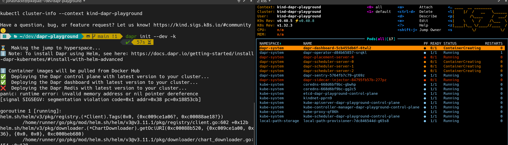

# dapr-playground
Example project showing DAPR capabilities


## Kickstart

```shell
# fire up kind
kind create cluster --image kindest/node:v1.32.3 --wait 5m --name dapr-playground

# Init DAPR runtime into local kind cluster leveraging DAPR cli (need to install it beforehand)
dapr init --dev -k
```

DAPR should now be fired up into our kind cluster:



Check via `dapr status -k` if DAPR initialized correctly: 

```shell
dapr status -k 
  NAME                   NAMESPACE    HEALTHY  STATUS   REPLICAS  VERSION  AGE  CREATED              
  dapr-dashboard         dapr-system  True     Running  1         0.15.0   1m   2025-03-14 10:51.37  
  dapr-sentry            dapr-system  True     Running  1         1.15.3   1m   2025-03-14 10:51.36  
  dapr-placement-server  dapr-system  True     Running  1         1.15.3   1m   2025-03-14 10:51.37  
  dapr-operator          dapr-system  True     Running  1         1.15.3   1m   2025-03-14 10:51.36  
  dapr-sidecar-injector  dapr-system  True     Running  1         1.15.3   1m   2025-03-14 10:51.36 
``` 

As [my colleague wrote](https://www.codecentric.de/en/knowledge-hub/blog/exploring-dapr-a-deep-dive-into-distributed-application-runtime):

> Not only does this command install the Dapr runtime, but it also deploys a default Zipkin installation as a tracing backend and a Redis instance for pub/sub and state store purposes.

Check them out via

```shell
dapr components -k
```

# Links

See the great intro posts by my colleague Manuel:

https://www.codecentric.de/en/knowledge-hub/blog/modern-microservices-unleashing-the-power-of-net-core-aspire-and-dapr

https://www.codecentric.de/en/knowledge-hub/blog/exploring-dapr-a-deep-dive-into-distributed-application-runtime

